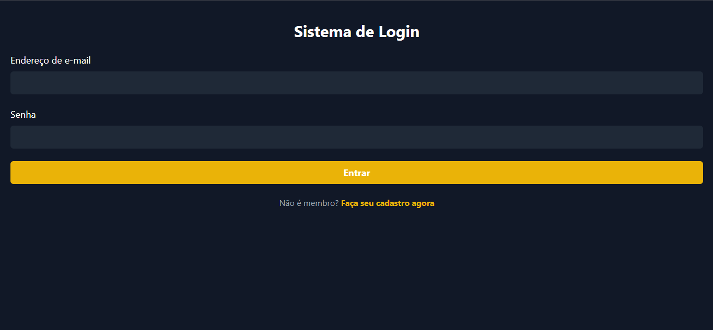

# Sistema de Login

Este é um projeto simples de uma tela de login utilizando HTML e Tailwind CSS.

## Captura do projeto



## Estrutura do Projeto

O projeto consiste em uma página HTML que exibe um formulário de login estilizado com Tailwind CSS. A estrutura básica inclui:

- **HTML:** Estrutura da página contendo campos de e-mail e senha, além de um botão de login.
- **CSS:** O arquivo CSS gerado com Tailwind está localizado na pasta `dist/` (que não foi incluída neste repositório para evitar arquivos compilados).

## Pré-requisitos

Este projeto não utiliza `Node.js` diretamente, mas o Tailwind CSS geralmente depende do `Node.js` para processar o CSS. Caso deseje gerar ou atualizar o CSS personalizado, você precisará instalar o Node.js e o Tailwind CSS conforme as instruções abaixo.

## Configuração do Ambiente

1. **Instale o Node.js**: Se ainda não tiver, faça o download e instale o Node.js a partir de [nodejs.org](https://nodejs.org/).

2. **Instale o Tailwind CSS**: No terminal, navegue até a pasta do projeto e execute:
   ```bash
   npm install -D tailwindcss
3.  **Crie o arquivo de configuração do Tailwind** (caso ainda não exista):
    
    bash
    
    Copiar código
    
    `npx tailwindcss init` 
    
4.  **Compile o CSS**: Após configurar, gere o CSS usando o seguinte comando:
    
    bash
    
    Copiar código
    
    `npx tailwindcss -i ./src/input.css -o ./dist/output.css --watch` 
    
    Este comando compilará o CSS para o arquivo `dist/output.css`, que é o arquivo utilizado no HTML.
    

## Estrutura de Pastas

-   `src/`: Contém o arquivo `input.css` com as configurações do Tailwind.
-   `dist/`: Pasta onde o CSS compilado (`output.css`) é armazenado. Esta pasta foi adicionada ao `.gitignore` e, portanto, não está presente no repositório.
-   `node_modules/`: Pasta onde as dependências do projeto são instaladas. Também foi adicionada ao `.gitignore`.

## Como Rodar

1.  Abra o arquivo `index.html` em seu navegador para visualizar a página de login.
2.  Se estiver fazendo mudanças no CSS, deixe o comando `npx tailwindcss -i ./src/input.css -o ./dist/output.css --watch` rodando no terminal para compilar o CSS em tempo real.

## Informações Adicionais

-   **node_modules** e **dist** não foram incluídos neste repositório para evitar o excesso de arquivos e reduzir o tamanho do projeto.
-   Se precisar dos arquivos do Tailwind, siga as etapas de configuração acima para instalá-los e compilar o CSS.

## Tecnologias Utilizadas

-   HTML
-   [Tailwind CSS](https://tailwindcss.com/)

----------

Sinta-se à vontade para clonar e modificar este projeto conforme necessário!